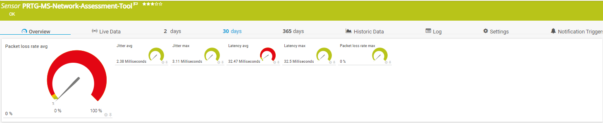

# PRTG-MS-Network-Assessment-Tool.PS1

<!-- ABOUT THE PROJECT -->
### About The Project
Project Owner: Jannos-443

PRTG Sensor script to monitor Paket loss, Jitter and Latency with the Network Assessment Tool

Using Microsoft Teams Assessment Tool to monitor the network quality to microsoft teams.
Can be used to verify that the WAN connection has good quality.

Free and open source: [MIT License](https://github.com/Jannos-443/PRTG-Sensors/blob/main/LICENSE)

<!-- GETTING STARTED -->
1. Place `PRTG-MS-Network-Assessment-Tool.ps1` under `C:\Program Files (x86)\PRTG Network Monitor\Custom Sensors\EXEXML`

2. Download Microsoft Network Assessment Tool -> https://www.microsoft.com/en-us/download/details.aspx?id=103017

3. Create new sensor

   | Settings | Value |
   | --- | --- |
   | EXE/Script Advanced | PRTG-MS-Network-Assessment-Tool.ps1 |
   | Parameters | -CustomRelayFQDN "worldaz.tr.teams.microsoft.com" -CustomMediaDuration 30 |
   | Scanning Interval | 15 minutes |


## Usage

### test against the default FQDN

```powershell
-CustomRelayIP "worldaz.tr.teams.microsoft.com" -CustomMediaDuration 30
```

### test against a CustomRelayIP

```powershell
-CustomRelayIP "52.114.249.112" -CustomMediaDuration 30
```

