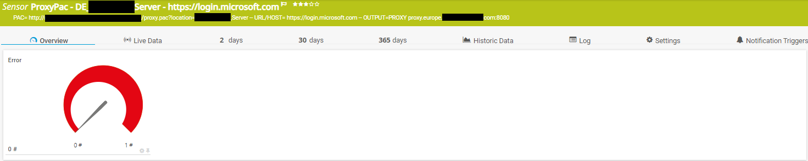
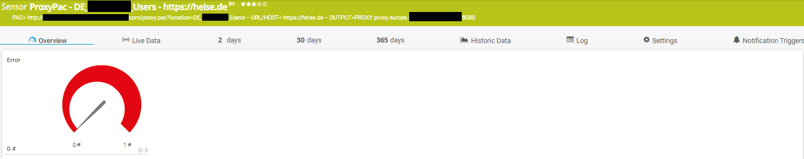

# PRTG-ProxyPac.PS1

<!-- ABOUT THE PROJECT -->
### About The Project
Project Owner: Jannos-443

PRTG Sensor script to monitor Proxy PAC Resolution and Syntax

Using powershell this script validates a proxy pac result.

You can use the -Test_URL parameter to define a URL, -ProxyPacUrl to define the PAC file and -MatchResult with a regex String to validate the output against.


Regular Expression: https://docs.microsoft.com/en-us/powershell/module/microsoft.powershell.core/about/about_regular_expressions?view=powershell-7.1


Free and open source: [MIT License](https://github.com/Jannos-443/PRTG-Sensors/blob/main/LICENSE)

<!-- GETTING STARTED -->
1. Place `PRTG-ProxyPac.ps1` under `C:\Program Files (x86)\PRTG Network Monitor\Custom Sensors\EXEXML`

2. Download "pactester.exe" and place it somewhere
   - https://pacparser.manugarg.com/ or https://github.com/manugarg/pacparser/releases
   - Example: `-PacTester_Path "C:\Program Files (x86)\PRTG Network Monitor\Custom Sensors\EXEXML\pacparser\pactester.exe"`


2. Create new sensor

   | Settings | Value |
   | --- | --- |
   | EXE/Script Advanced | PRTG-ProxyPac.ps1 |
   | Parameters | -ProxyPacUrl "http://pac.europe.contoso.com/proxy.pac?location=Test_Server" -Test_URL "https://login.microsoft.com" -MatchResult "^(PROXY proxy.europe.contoso.com:8080)$" |
   | Scanning Interval | 15 minutes |


## Usage

### validate that a specific url goes over proxy proxy.europe.contoso.com:8080

```powershell
-ProxyPacUrl "http://pac.europe.contoso.com/proxy.pac" -Test_URL "https://login.microsoft.com" -MatchResult "^(PROXY proxy.europe.contoso.com:8080)$"
```

### validate that a specific url goes over direct

```powershell
-ProxyPacUrl "http://pac.europe.contoso.com/proxy.pac" -Test_URL "https://login.microsoft.com" -MatchResult "^(DIRECT)$"
```

### validate that a specific url goes over proxy proxy.europe.contoso.com:8080

```powershell
-ProxyPacUrl "http://pac.europe.contoso.com/proxy.pac?location=DE_Server" -Test_URL "https://login.microsoft.com" -MatchResult "^(PROXY proxy.europe.contoso.com:8080)$"
```




